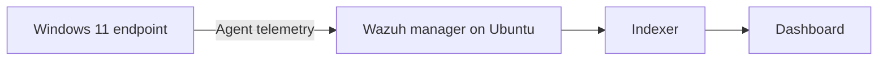

# Secure Home SOC: Wazuh and Windows endpoint

An independent home lab for learning how endpoint events reach a security monitoring platform, how to validate the service behind the dashboard, and how to document what the evidence does **and does not** establish.

**Status:** Working lab; baseline and one indexed alert observed on 24 September 2026. Access control, backup/restore, and outage/recovery exercises remain in progress.

## At a glance

| Component | Implementation |
| --- | --- |
| Monitoring host | Dedicated HP laptop running Ubuntu Server 24.04.5 LTS |
| Monitoring stack | Wazuh manager, indexer and dashboard 4.14.7; Filebeat 7.10.2 |
| Endpoint | Lenovo laptop running Windows 11 and the Wazuh agent |
| Administration | SSH, PowerShell, Windows Event Viewer, Wazuh dashboard |

The diagram shows the **logical event flow**. The three Wazuh components run on the Ubuntu host. It does not assert a verified end-to-end packet trace or production isolation.

## What I implemented and checked

1. Installed the Wazuh central components on a dedicated Ubuntu Server and verified that manager, indexer, dashboard and Filebeat services were active at the baseline check.
2. Enrolled a Windows 11 agent. The dashboard displayed the endpoint as Active on 24 September 2026.
3. Confirmed an indexed Windows logoff event: Windows Event ID `4634` appeared in Wazuh Threat Hunting as rule `67023`, level `3`.
4. Created a separate benign Windows Application event, ID `901`, and verified it **locally** with PowerShell. No corresponding Threat Hunting alert was visible. Since all-event archives were disabled, this test does **not** establish whether that particular event reached the manager. I recorded this limitation instead of treating it as a successful detection.
5. Collected a service, disk and listener baseline for later health and access-control testing.

See [architecture](docs/architecture.md) and [evidence register](docs/evidence.md) for the claim-by-claim detail.

## What this demonstrates

- Service checks and troubleshooting across Linux and Windows.
- Agent enrollment and validation of an indexed security event.
- Careful distinction between a Windows source event, agent collection configuration, manager ingestion and a visible alert.
- Reproducible notes with dates, limitations and next tests.

## Work in progress

The next tests are a fresh deliberate event-to-index trace, management access checks, routine capacity tracking, a protected backup with a limited restore, and a controlled agent outage/recovery exercise. These are **not** presented as completed results. See the [roadmap](docs/roadmap.md).

## Evidence and privacy

This public case study generalizes the home network and excludes credentials, host identifiers, account names, raw personal logs and live access details. Screenshots will be added only after redaction and verification. It is a learning environment, not a production SOC or a claim of enterprise incident response.
