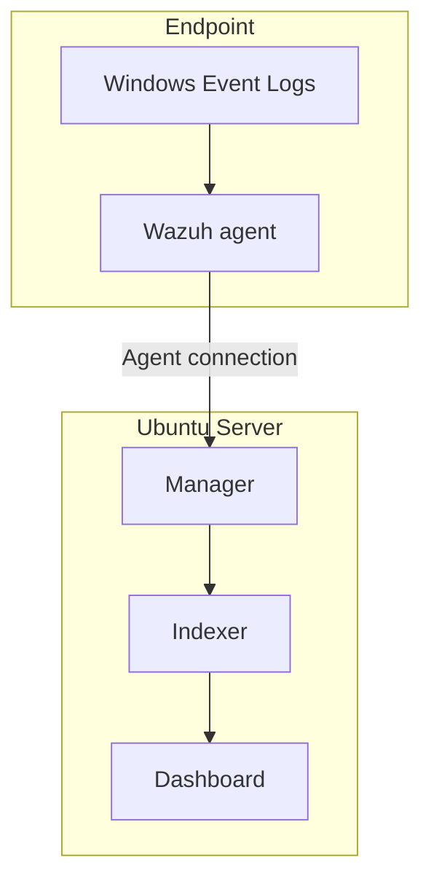

# Architecture and scope

The lab has one Ubuntu Server host running the Wazuh manager, indexer and dashboard, plus a separate Windows 11 endpoint running the Wazuh agent. The agent reports to the manager, which forwards data through the indexing path for dashboard analysis.

## Trust boundaries

| Boundary | Confirmed | Further test |
| --- | --- | --- |
| Windows endpoint → manager | Agent appeared Active and a Windows event produced an indexed alert on 24 September 2026 | Trace another deliberately generated event through each stage |
| Administrator → dashboard | Browser login from a home-network device succeeded | Record approved management paths and denied paths |
| Server → backup destination | No tested off-host backup yet | Make a protected backup and restore a selected item |

This is a functional and evidence-oriented design description. Access restrictions and recovery resilience are not claimed until the associated tests pass. Raw IP addresses, external addresses, hostnames, keys and credentials are intentionally excluded.
